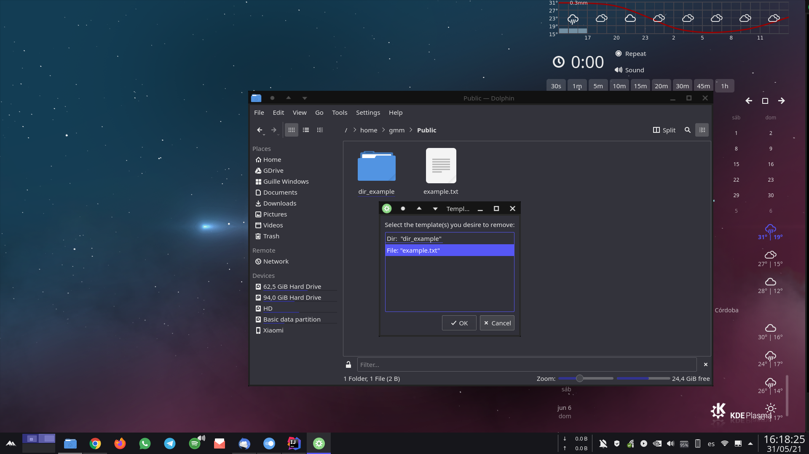

# KDE 5 Template Manager

### KDE 5 Dolphin Service Menu for managing templates.

**Templates** are such a good feature for productivity. They are used to define a unique non-executable
file format intended specifically for a particular application and help us to create that file / directory
automatically. They are supported by Desktop Environments and File Managers used in most of the Linux
distributions.

*KDE 5 Plasma* and *Dolphin* also support it, but you have to create a **.desktop* file manually 
to create the template, which has a difficult syntax to remember. The goal of this project is to 
create a **Dolphin Service Menu for building templates automatically** just by selecting the
desired file / directory, letting the user to choose the different template parameters (name, comments, icon).
It also provides functionality to remove previously created templates by this tool when uninstalling it 
or anywhen we want.

You can template **any file or directory** and it is available in English, Spanish, French, Italian, German, Portuguese and Russian languages. If user
language is not in the list, English language will be selected by default.

## Installation

Download the package, extract it and run the following command to **install** this Dolphin Service. 

    sh ./install.sh

If you don't like it, you can **uninstall** it by running:

    sh ./uninstall.sh

## Usage

It is quite easy to use this plugin. Just select the file you want to use as template, do right-
click and choose the option *Manage template(s)* -> *Create template...*. Then enter the info asked by the
dialogs that will appear and everything should be ok. Parameters name and icon are required, but
comment is optional.

You can also delete templates created with this tool. You just have to do right-click and select 
*Manage template(s)* -> *Remove existing template(s)*. Then, a windows will prompt with all the 
templates, where you can select as many as you want to remove. Finally, confirm, and they will be deleted. 

It is not recommended removing previous templates you kept in your disk before you first installed this plugin 
using the template eraser tool, as some bugs may appear and deletion may not work.

