# KDE 5 Template Manager

### KDE 5 Dolphin Service Menu for managing templates.

    
    &nbsp;&nbsp;&nbsp;&nbsp;&nbsp;
    
    &nbsp;&nbsp;&nbsp;&nbsp;&nbsp;
    
    &nbsp;&nbsp;&nbsp;&nbsp;&nbsp;
    <a href="https://github.com/gmm96/KDE-5-Template-Manager">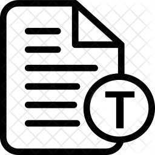</a>

**Templates** are such a good feature for productivity. They are used to define a unique non-executable
file format intended specifically for a particular application and help us to create that file / directory
automatically. They are supported by Desktop Environments and File Managers used in most of the Linux
distributions.

*KDE 5 Plasma* and *Dolphin* also support them, but you have to create a **.desktop* file manually 
to create the template, which has a difficult syntax to remember. The goal of this project is to 
create a **Dolphin Service Menu for building templates automatically** just by selecting the
desired file / directory, letting the user to choose the different template parameters (name, comments, icon).
It also provides **functionality to edit any of these parameters or to remove previously created templates by this
tool** anywhen you want, including the moment when uninstalling the plugin.

You can template **any file or directory** thanks to this plugin, and it is available in **several languages**: 
English, Spanish, French, Italian, German, Portuguese, Russian, Czech, Polish, Estonian, Romanian, Finish, Swedish,
Norwegian, Turkish, Danish, Ukrainian, Hungarian, Icelandic and Greek languages. Most of them has been translated 
using Google Translator, so some mistakes may appear in texts. If user language is not in the list, English language 
will be selected by default. 

If you want to help me to add support for more languages, you are free to create a Pull Request modifying files 
**TemplateManagerLocalization.sh**, **install.sh** and **uninstall.sh** with the new translations, or you can 
contact me by telegram: [@supremoh](https://t.me/supremoh).

## Installation

Download the package, extract it and run the following command to **install** this Dolphin Service. 

    ./install.sh

If you don't like it, you can **uninstall** it by running:

    ./uninstall.sh

## Usage

It is quite easy to use this plugin. To **create a template**, just select the file(s) / directory(ies) you want to 
use as template, do right-click and choose the option ***Manage template(s)* -> *Create template from this object***. 
Then enter the info asked by the dialogs that will appear and everything should be ok. Parameters name and icon 
are required, but comment is optional. When the template is created, you can use it by doing right-click, select 
*Create new* menu and choose the template you want to use.

You may need to **edit a template**, so you can use this tool. No need to select any file, just do right-click and 
select ***Manage template(s)* -> *Edit existing template...***. Then, you should select the template you want to edit,
and a windows will prompt with all the actions you are able to perform:
- Edit name, comment or icon.
- Open current template with default application.
- Update with new template (including option to back up last template).
- Discard new template.
- Open new template with default application.
- Save and exit.

You are free to edit anything you want, you just need to select *Save and exit* at the end to keep the changes in disk. 
If you don't want to save the changes, just click on *Cancel* to discard them. 

You can also **delete templates** created with this tool. You just have to do right-click and select 
***Manage template(s)* -> *Remove existing template(s)...***. Then, a windows will prompt with all the 
templates, where you can select as many as you want to remove. Finally, confirm, and they will be deleted. 

**It is not recommended removing previous templates** you kept in your disk before you first installed this plugin 
using the template eraser tool, as some bugs may appear and deletion may not work.

## Screenshots

### Template creation
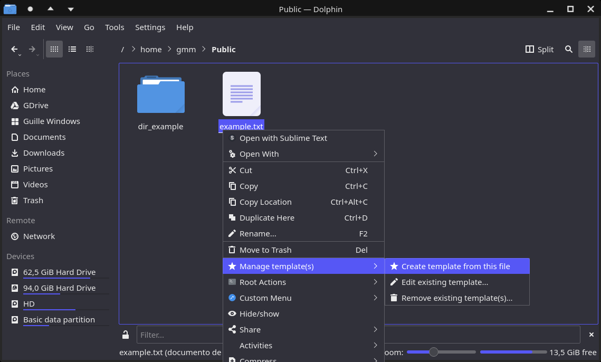

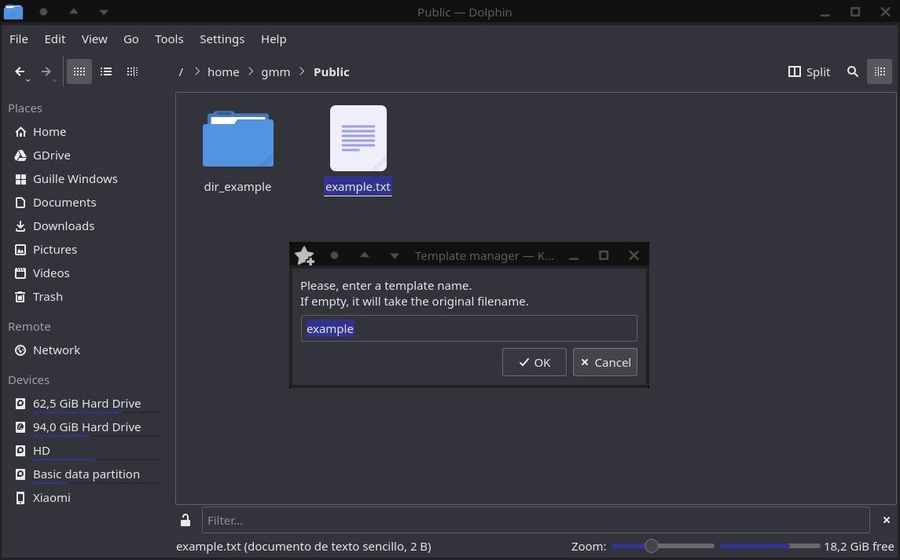

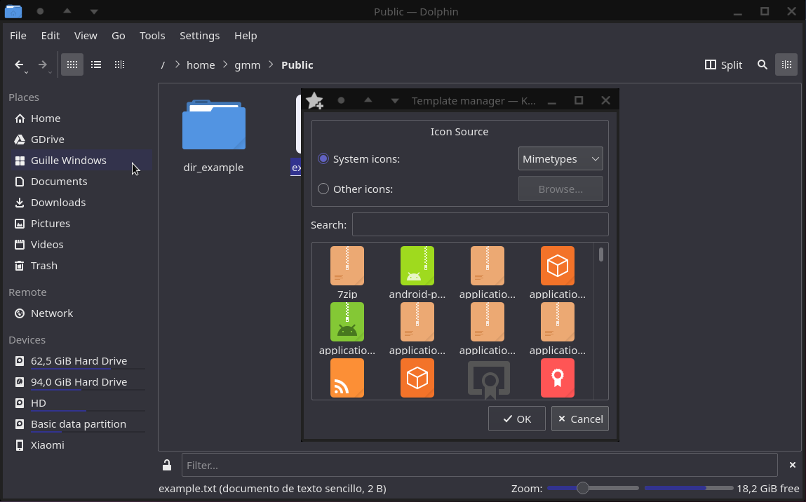

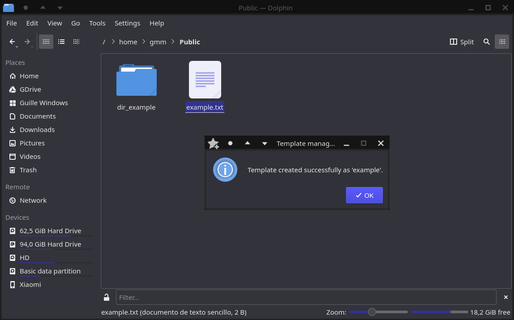

 ### Template edition
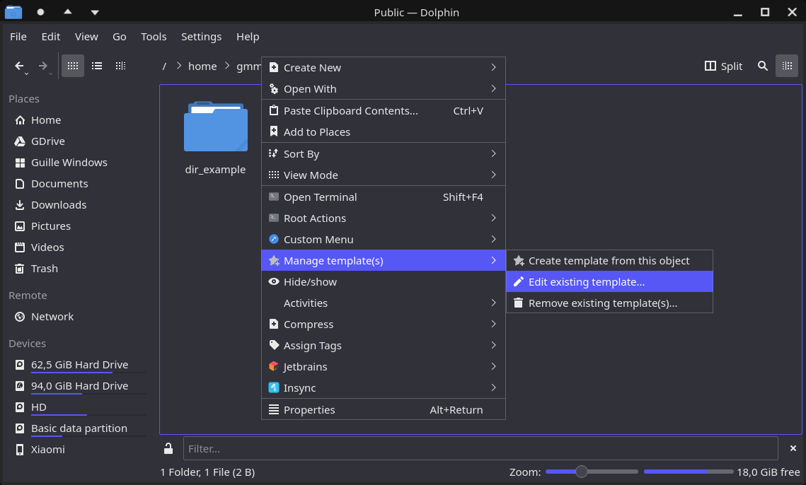

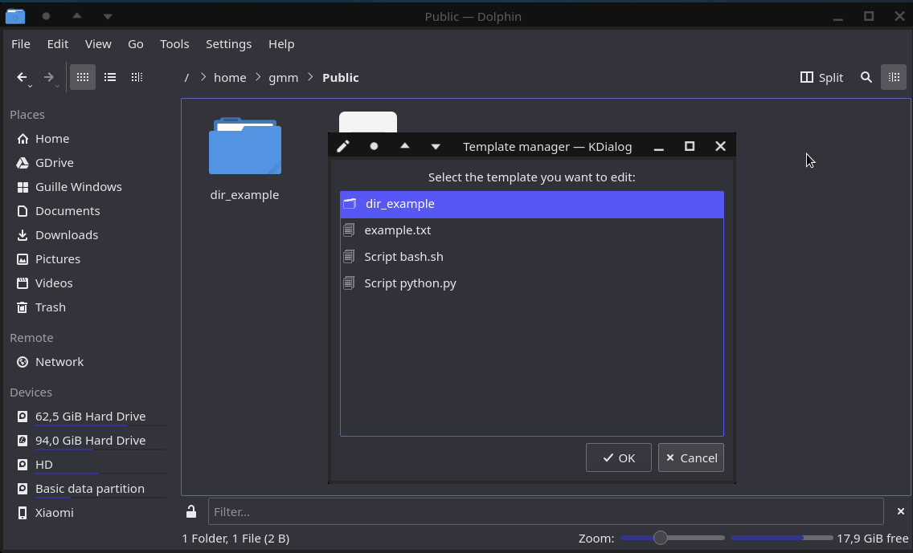

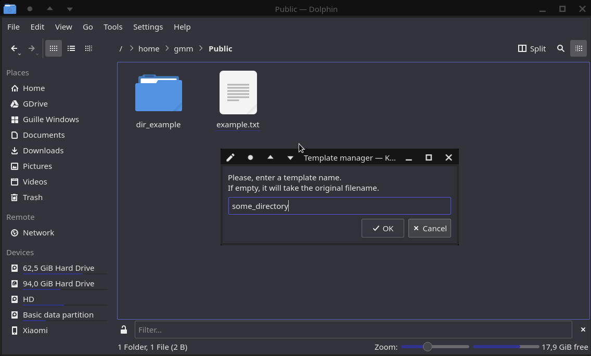

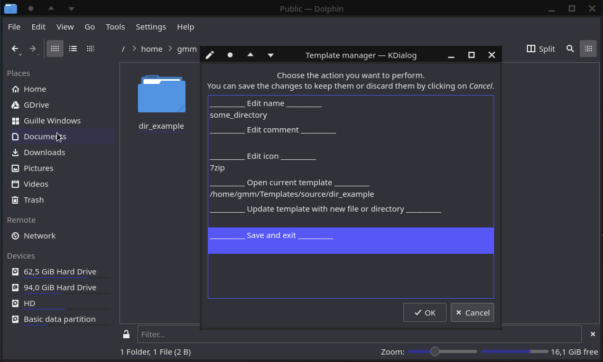

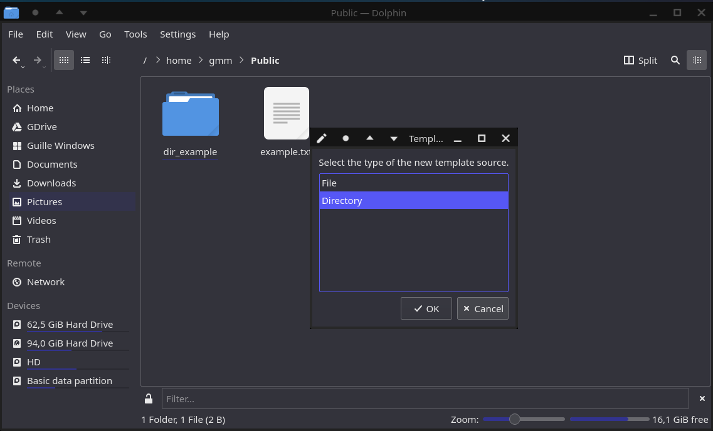

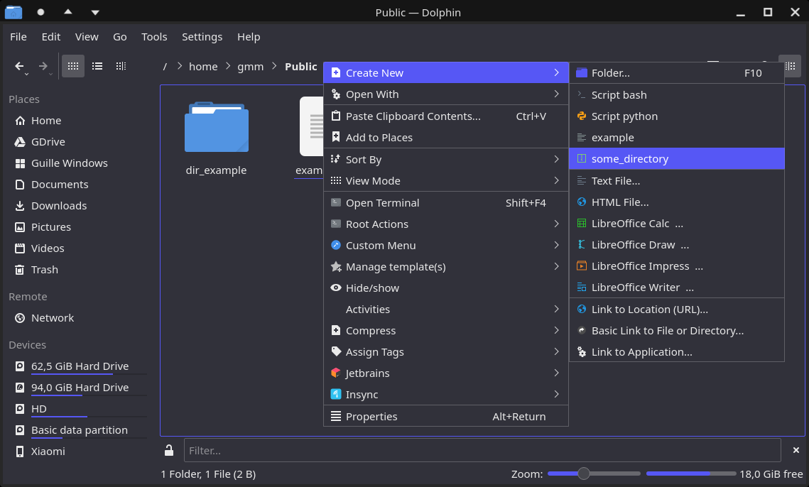

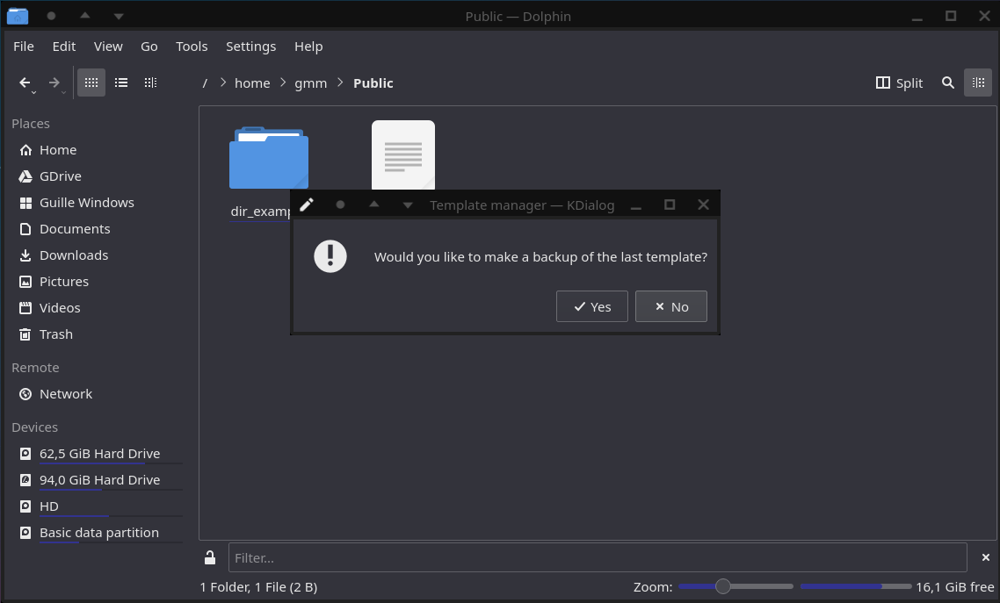

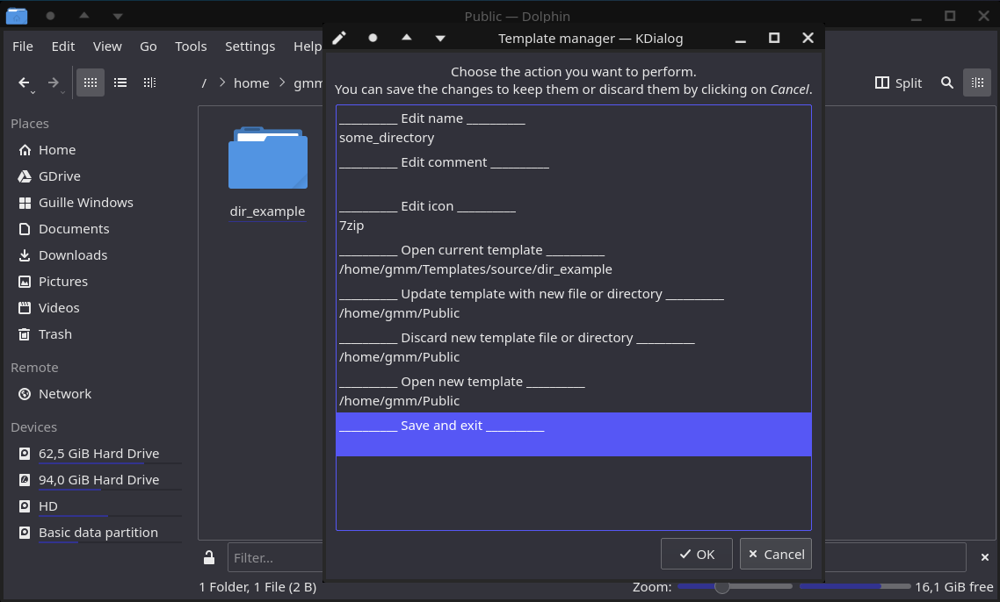

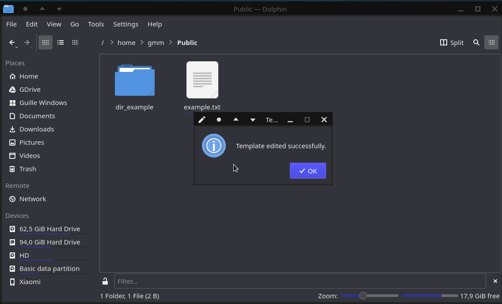

# Template deletion
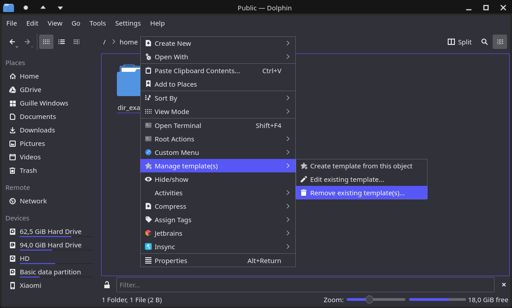

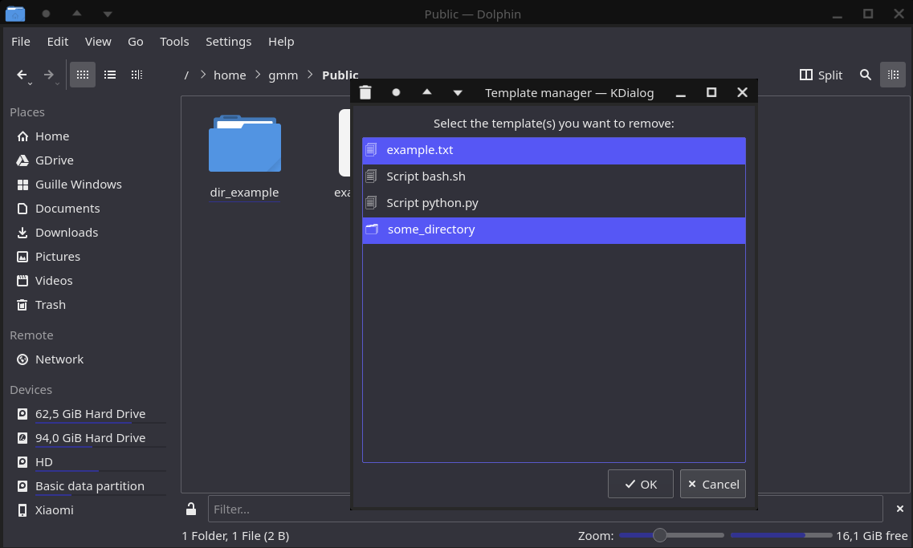

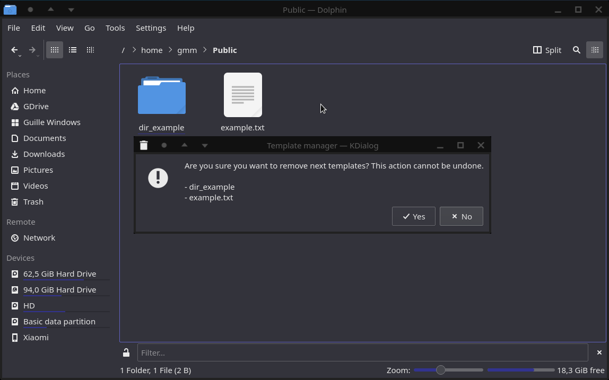

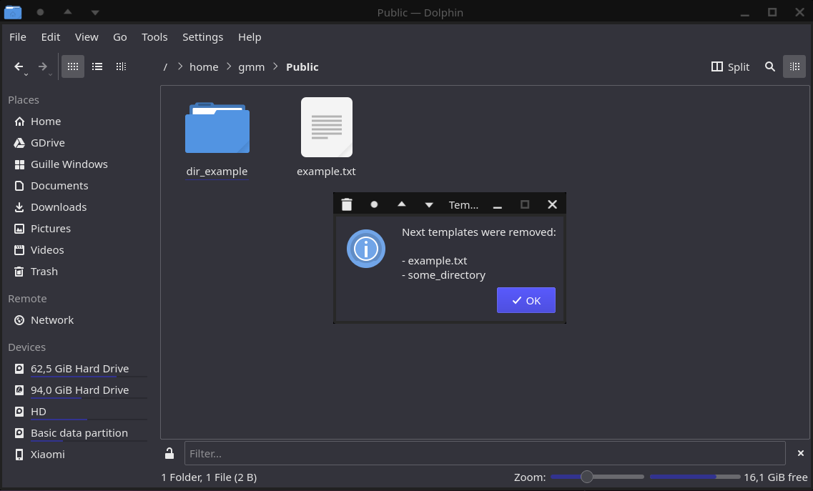