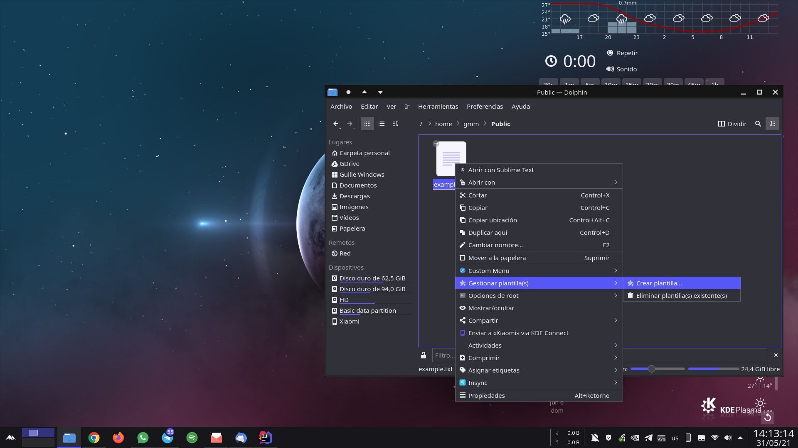
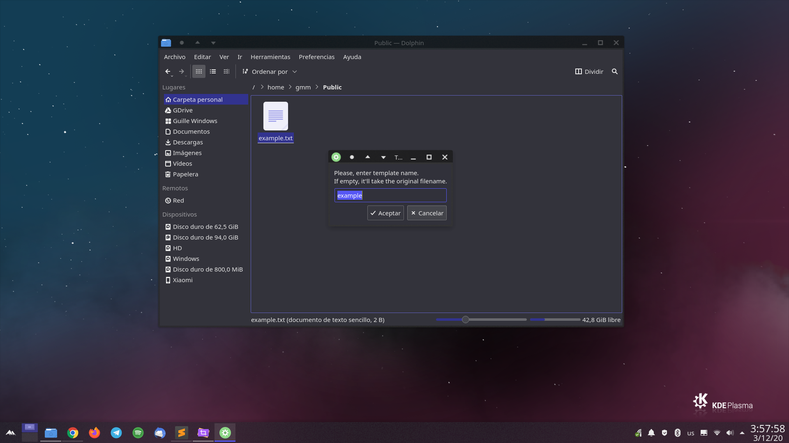
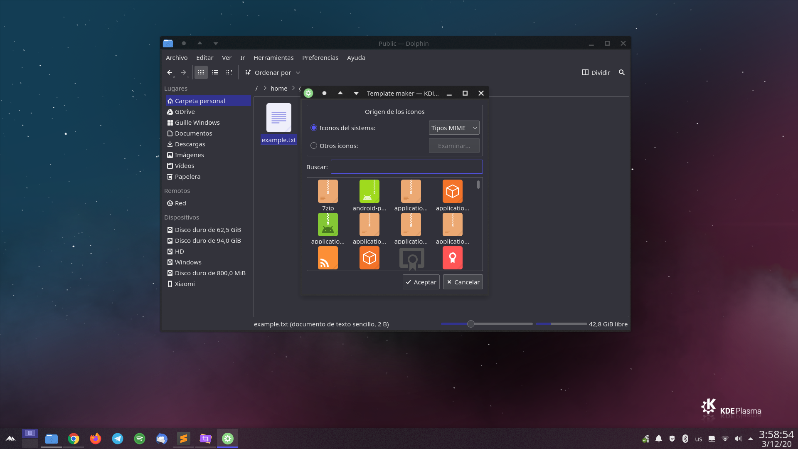
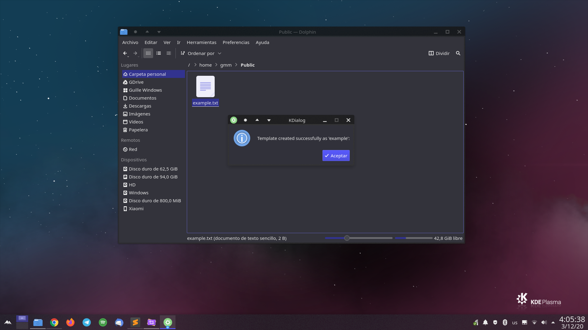
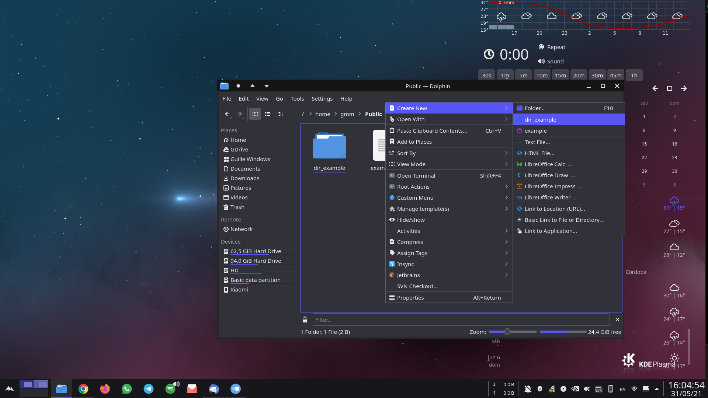

# KDE 5 Template Maker

### KDE 5 Dolphin Service Menu for creating a template from an existing file.

**Templates** are such a good feature for productivity. They are used to define an unique non-executable
file format intended specifically for a particular application and help us to create that file 
automatically. They are supported by Desktop Environments and File Managers used in most of the Linux
distributions.

*KDE 5 Plasma* and *Dolphin* also support it, but you have to create a **.desktop* file manually 
to create the template, which has a difficult syntax to remember. The goal of this project is to 
create a **Dolphin Service Menu for building a template automatically** just by selecting the
desired file, letting the user to choose the different template parameters (name, comments, icon).

## Installation

Download the package, extract it and run the following command to **install** this Dolphin Service. 

    sh ./install.sh

If you don't like it, you can **uninstall** it by running:

    sh ./uninstall.sh

## Usage

It is quite easy to use this plugin. Just select the file you want to use as template, do right 
click and choose the option *Make template from this file...*. Then enter the info asked by the
dialogs that will appear and everything should be ok. Parameters name and icon are required, but
comment is optional.

